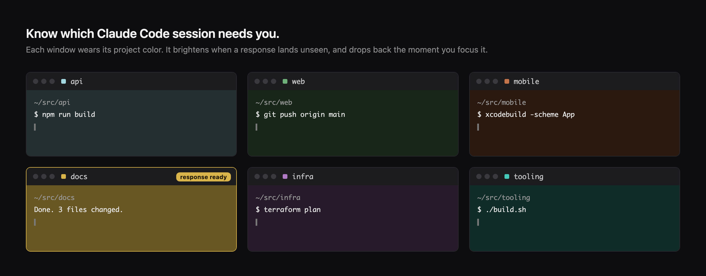

# claude-session-tint

**Know which Claude Code session needs you.**

Tag a terminal window with a project. It wears that project's color quietly while
it works, lights up when a response lands, and drops back the moment you look at
it.

If you run one Claude Code session, you do not need this. If you run eight, you
are currently alt-tabbing through all of them to find the one that finished.



```
,api        tag this window "API"        (no turn, no tokens, no reply)
,           show the palette
,off        untag
```

---

## The part worth stealing even if you never install this

`,api` runs a command from inside a live Claude Code session **without invoking
the model**. No turn, no tokens, no assistant message in your transcript. The
window just changes color.

That is a `UserPromptSubmit` hook returning a blocking decision:

```json
{
  "decision": "block",
  "reason": "<what to show the user>",
  "hookSpecificOutput": {
    "hookEventName": "UserPromptSubmit",
    "suppressOriginalPrompt": true
  }
}
```

Claude Code sees the blocking decision and never queries the model. `reason` is
shown to you directly. `suppressOriginalPrompt` stops your `,api` from being
echoed back into the transcript.

Two details that are easy to get wrong:

- **The hook must be synchronous.** An `async: true` hook returns after the
  prompt has already gone to the model, so it cannot gate anything.
- **Exit 2 as well as printing the JSON.** With exit 0 there is an earlier
  success branch that can return before the blocking decision is applied.

You can use this shape for any in-session command: toggling a flag, bumping a
counter, kicking off a build. `prompt-hook.sh` is 100 lines and is the whole
pattern.

---

## What it looks like

| State | Window |
|---|---|
| Idle, tagged `api` | body washed 22% toward that project's color |
| Response finished, you were elsewhere | jumps to 48%, clearly lit |
| You focus the window | back to 22% within about a second |
| Untagged | stays your normal background, still lights neutral grey when unread |

Because it paints the window body, lit windows are obvious in Mission Control
and cmd-tab, not just when the window is already visible.

---

## Terminal support, honestly

| Terminal | Window coloring | `,project` zero-turn command |
|---|---|---|
| macOS Terminal.app | yes, tested | yes |
| iTerm2, Ghostty, kitty, WezTerm | **no** | yes |
| Linux, Windows | no | yes |

The coloring drives Terminal.app through AppleScript, so it is macOS only. It
degrades to a silent no-op elsewhere rather than erroring.

If you use iTerm2, Ghostty, or kitty you likely do not want this half anyway:
those terminals have **native tab colors**, which Terminal.app has never had.
This exists because Terminal.app gives you exactly one lever, the session
background color, and no way to color a tab. See "Adding a terminal" below.

---

## Install

Requires macOS and Claude Code.

**As a plugin (recommended).** From inside Claude Code:

```
/plugin marketplace add dotcomjack/claude-session-tint
/plugin install claude-session-tint@dotcomjack
```

That is the whole install. Hooks and the `/tabtint` command register themselves,
and a starter palette ships with the plugin, so there is nothing to copy and no
settings file to edit. Uninstall with `/plugin uninstall claude-session-tint`.

Your palette lives at `~/.claude/tabtint-palette.conf`, outside the plugin
directory, so it survives plugin updates.

<details>
<summary><b>Manual install instead</b> (no plugin system, adds a shell command)</summary>

Requires `jq`.

```bash
git clone https://github.com/dotcomjack/claude-session-tint.git
cd claude-session-tint
./install.sh
```

The installer **merges** into `~/.claude/settings.json`, it does not replace it.
Your existing hooks are preserved, the file is backed up to
`settings.json.bak-tabtint` first, and the result is validated as JSON before
anything is written. Re-running is safe.

```bash
./install.sh --uninstall     # restores every window it touched, then removes itself
```

</details>

The plugin puts `tabtint` on the Bash tool's PATH. To also use it from your own
shell, symlink it:

```bash
ln -sf ~/.claude/plugins/cache/dotcomjack/claude-session-tint/*/bin/tabtint ~/.local/bin/tabtint
```

---

## Use

Edit `~/.claude/tabtint-palette.conf` with your projects:

```
#HEX	KEY	LABEL	EMOJI
#A3D8E1	api	API	🔵
#6FB07A	web	Web	🌿
```

Tab separated. `HEX` is the identity color at full strength, never painted at
full strength. `EMOJI` is optional, see below.

Then, from inside a Claude Code session:

```
,api            tag this window
,               palette plus what this window is
,off            untag, restore original background
,idle off       only light up on unread, no resting tint
```

Or from a shell: `tabtint api`, `tabtint list`, `tabtint sync`, `tabtint status`.

### Tuning

```bash
export TABTINT_IDLE_PCT=30    # resting tint, default 22
export TABTINT_ATTN_PCT=55    # unread, default 48
tabtint sync
```

Below about 15% everything collapses toward black and the colors stop being
tellable apart. That is a property of washing a color over a dark background,
not a bug.

### The emoji column

No terminal here lets you color the tab chrome, but every terminal renders an
emoji in the tab title. Tagging a window copies a ready line to your clipboard:

```
/rename 🔵 API
```

Paste it and the tab bar itself carries a marker. Claude Code owns the title, so
this hands you the line instead of fighting it for control.

---

## How it works

- `Stop` hook: response finished. If the window is not focused, paint it lit.
- `UserPromptSubmit` hook: you typed something here, so drop back to resting.
- `SessionStart` hook: apply the resting state.
- One shared watcher polls for the focused window and clears it, then exits when
  nothing is lit. It polls at 1Hz for the first 12 seconds after anything lights
  up, then backs off to 3s.

State lives in `~/.claude/state/tabtint/`, one small file per tty. Each window's
true original background is captured once, before anything is painted, so
uninstalling always restores exactly what you had.

### Privacy

No network calls anywhere. Nothing writes your prompt text to disk. The
`UserPromptSubmit` hook does receive every prompt you type, which is inherent to
that hook type, but it pattern-matches and discards. When it does intercept a
`,project` line, the model is never invoked, so that text does not leave your
machine at all.

---

## Adding a terminal

`tabtint.sh` isolates every terminal interaction in four functions:
`focused_tty`, `read_bg`, `write_bg`, and `all_ttys`. Porting to a terminal with
native tab colors means replacing those. For iTerm2 that is an escape sequence
rather than AppleScript, and for kitty it is `kitty @ set-tab-color`. PRs
welcome.

---

## License

MIT. Built by [DotcomJack](https://dotcomjack.com).
